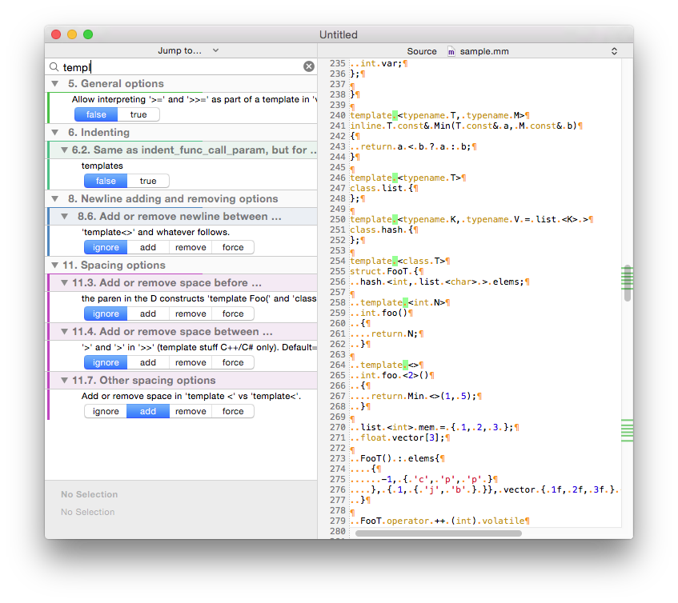

# Coiffeur

Coiffeur is a style sheets editor for both [uncrustify](http://uncrustify.sourceforge.net) and [clang-format](http://clang.llvm.org/docs/ClangFormat.html).   

You change the style sheet parameters and observe the changes reflected in the sample source code file. 

On this screenshot you see the changes after I toggled from **remove** to **add** in the **Add or remove space in 'template <' vs 'template<'.** option. Coiffeur runs **uncrustify** in the background, displays the newly formatted document, and highlights where the changes have been made. 

## Requirements

Mac OS X 10.9+.

## Suggested Use

Use Coiffeur with the excellent Xcode [BBUncrustifyPlugin](https://github.com/benoitsan/BBUncrustifyPlugin-Xcode).

## Dependencies

The [Fragaria](http://www.mugginsoft.com/code/fragaria) framework for code syntax highlighting. The [Diff, Match, and Patch](https://github.com/JanX2/google-diff-match-patch-Objective-C) framework for recognizing the changes in the source code between edits. Both are included into the repository as submodules.

## Creator 

[Anton Leuski](https://github.com/leuski)

## License

Coiffeur is available under Apache v.2 license. See LICENSE file for info.

 